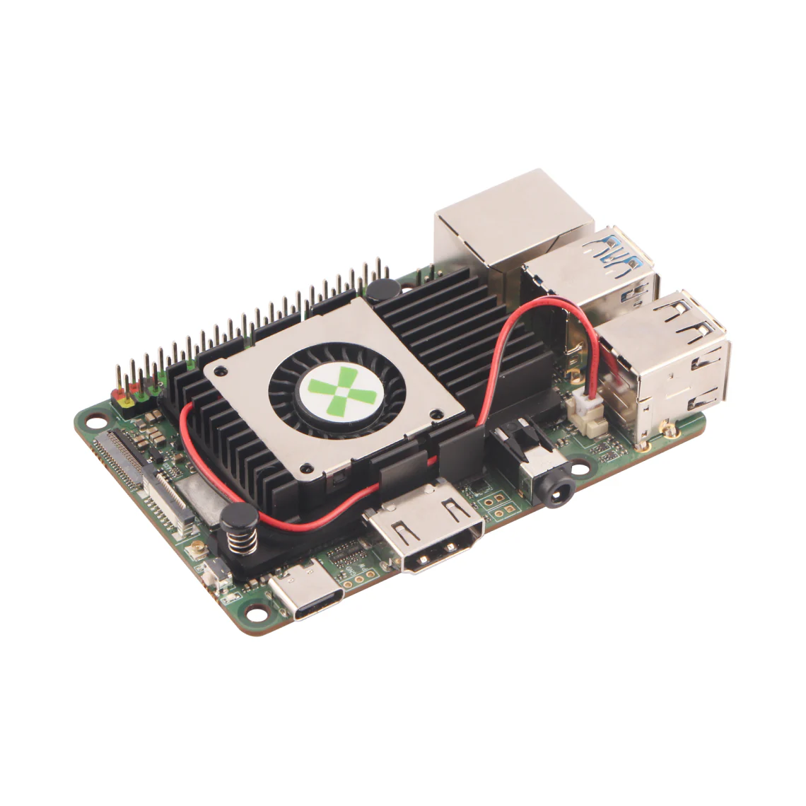
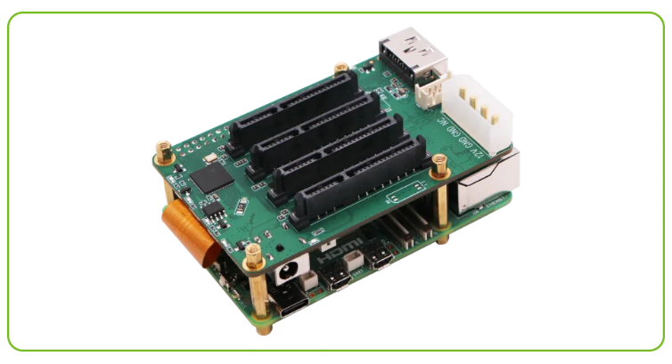
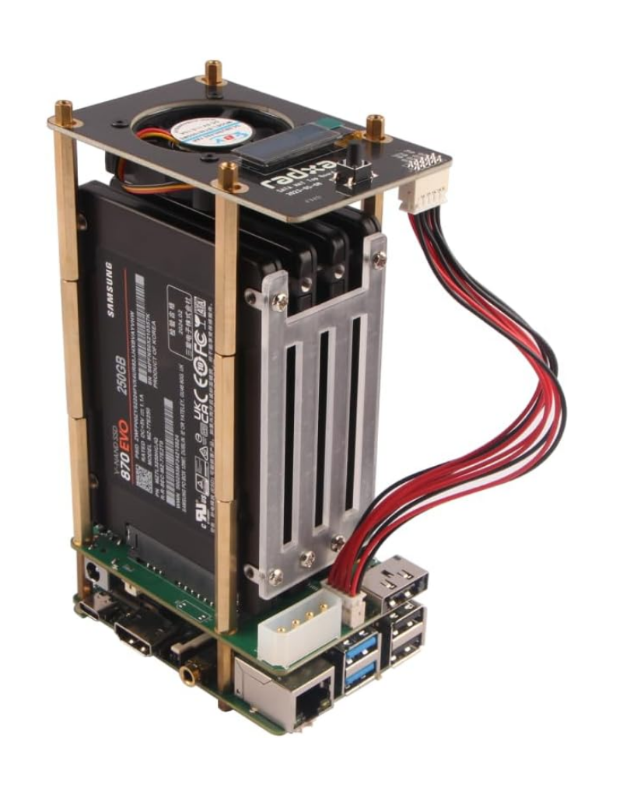

  <table style="border-collapse:collapse;width:100%;">
    <thead>
      <tr style="background-color:#f5f5f5;" align="center">
        <th style="border:1px solid #ddd;padding:8px;text-align:center;">Title:</th>
        <th style="border:1px solid #ddd;padding:8px;text-align:center;">Author:</th>
        <th style="border:1px solid #ddd;padding:8px;text-align:center;">last_updated:</th>
      </tr>
    </thead>
    <tbody>
      <tr style="background-color:#ffffff;" align="center">
        <td style="border:1px solid #ddd;padding:8px;text-align:center;">ROCK 5C Home Server</td>
        <td style="border:1px solid #ddd;padding:8px;text-align:center;">Lucas Costello</td>
        <td style="border:1px solid #ddd;padding:8px;text-align:center;">2025-10-7</td>
      </tr>
    </tbody>
  </table>

<!-- Introduction -->

  
<h2 id="intro" style="display:inline;">Assembly Overview</h2>

  

    

      This section provides a step-by-step guide to assemble the server. Everything you need besides a small wrench and screwdriver is included with the listed components.
      Be careful with the FPC Cable that connects the ROCK 5C to the Penta SATA HAT—it's delicate.
    

    
Use the images provided to assemble the components.

    
<strong>Note</strong>: <em>For the purpose of these instructions, consider the front of the ROCK 5C to be the shorter side with the USB/Ethernet ports.</em>

  

<!-- Step 1 -->

  
<h2 id="step-1" style="display:inline;">Step 1: Cooling the ROCK 5C</h2>

  

    <ul>
      <li>Apply the silicone sheet and attach the heatsink/fan unit.</li>
      <li>Refer to the image for a visual on how to place the unit, route the wires, and which connector to use.</li>
    </ul>
  

  

    <picture>
      
    </picture>
     
    (Source: <a href="https://arace.tech/products/radxa-heatsink-6540b-for-rock-5c?_pos=1&_psq=rock+5c+fan&_ss=e&_v=1.0">Arace</a>)
  

<!-- Step 2 -->

  
<h2 id="step-2" style="display:inline;">Step 2: Attaching the Penta SATA HAT</h2>

  

    <ul>
      <li>On the ROCK 5C, use the copper posts provided with the SATA HAT to make pillars using the remaining 4 mounting holes.</li>
      <li>Plug in the FPC cable so the ROCK and SATA HAT are connected. Lay the SATA HAT over the pillars and ensure everything lines up.</li>
      <li>Open the SATA HAT Top Board and grab the copper pillars from that accessory. Screw together 4× “risers” (each 3 pillars tall), then use them to build up the initial set of pillars and fasten down the SATA HAT.</li>
    </ul>
  

  

    <picture>
      
    </picture>
     
    (Source: <a href="https://radxa.com/products/accessories/penta-sata-hat/#overview">Radxa</a>)
  

<!-- Step 3 -->

  
<h2 id="step-3" style="display:inline;">Step 3: Installing Hard Drive Array</h2>

  

    <ul>
      <li>Before installing the SATA HAT Top Board, assemble your array of hard drives. This build uses 4 drives to take advantage of all SATA ports.</li>
      <li>Determine the correct orientation of your SSDs. Use the included screws to fasten the complete rectangular acrylic board to the side of the array facing the back of the ROCK 5C.</li>
      <li>Fasten the cutout acrylic board to the other side of the array. <em>The notch faces up.</em></li>
      <li>Line up the array of SSDs and connect them to the Penta SATA HAT.</li>
    </ul>
    
<em>(For a visual showing the correct orientation of the drive array, see the next step’s image.)</em>

  

<!-- Step 4 -->

  
<h2 id="step-4" style="display:inline;">Step 4: The SATA HAT Top Board</h2>

  

    <ul>
      <li>Align the pillars with the mounting holes on the Top Board, making sure the button faces the front of the ROCK 5C.</li>
      <li>Place and secure the Top Board.</li>
      <li>Using the provided cable, connect the 10-pin connector on the Top Board to the 10-pin connector on the SATA HAT. On the SATA HAT, the connector is between the Molex and eSATA interfaces.</li>
      <li>Below is a picture of the completely assembled server.</li>
    </ul>
  

  

    <picture>
      
    </picture>
     
    (Source: <a href="https://a.co/d/fXJQHji">Amazon</a>)
  

